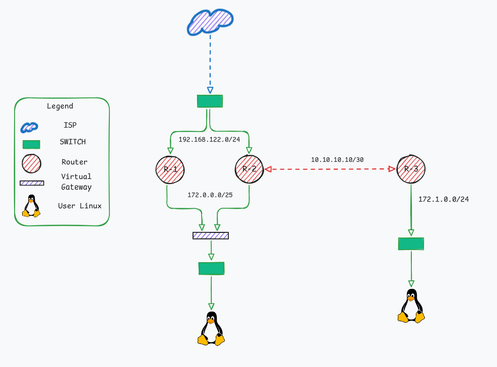

# Static Routing with VRRP Redundancy (MikroTik) – GNS3 Lab

## Objective
This lab demonstrates how to configure static routing and VRRP on MikroTik routers to provide gateway redundancy in a LAN environment.

## Topology

- **R1** and **R2** act as redundant gateways using VRRP.
- **R3** represents an internal or remote network.
- **Alpine Linux** are simulated with docker alpine or MikroTik DHCP clients.

## Devices Used
- 3x MikroTik RouterOS VMs
- 2x Virtual PCs
- GNS3 version 2.2.54
